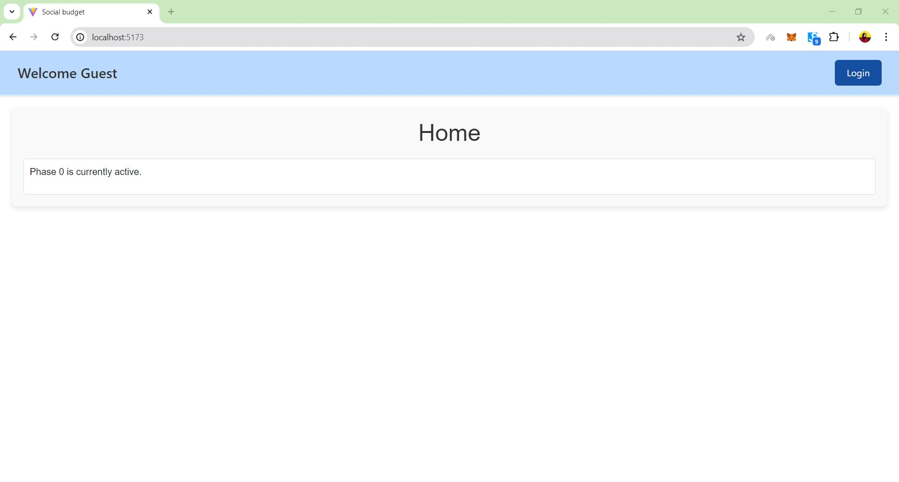

# Project: "Social Budget"
## Student: JABBARI ROSHANAK

## React Client Application Routes

- **Route `/`**: 
  - **Page Content and Purpose**: Displays the current phase of the system and renders the appropriate component based on the phase. If the user is not logged in, it shows the GuestsHome component.
  
- **Route `/login`**:
  - **Page Content and Purpose**: Displays the login form for users to log in.

## Main React Components

- **`Header` (in `Header.jsx`)**:
  - **Purpose and Functionality**: Displays the header with a welcome message and login/logout button. It fetches the user information if the user is not logged in.

- **`Home` (in `Home.jsx`)**:
  - **Purpose and Functionality**: Renders different components based on the current phase. It checks the current phase and updates it accordingly.

- **`Login` (in `Login.jsx`)**:
  - **Purpose and Functionality**: Provides a form for users to log in. If the user is already logged in, it redirects to the home page.

- **`GuestsHome` (in `GuestsHome.jsx`)**:
  - **Purpose and Functionality**: Displays the current phase for guests. In the final phase, it shows the `ApprovalVisibilityComponent`.

- **`BudgetDefinitionComponent` (in `BudgetDefinitionComponent.jsx`)**:
  - **Purpose and Functionality**: Allows admins to define the budget for the current phase. Displays a waiting message for regular members.

- **`ProposalManagementComponent` (in `ProposalManagementComponent.jsx`)**:
  - **Purpose and Functionality**: Allows users to submit, edit, and delete proposals. Admins can change the phase from this component.

- **`VotingPreferenceComponent` (in `VotingPreferenceComponent.jsx`)**:
  - **Purpose and Functionality**: Allows users to vote on proposals. Admins can change the phase from this component.

- **`ApprovalVisibilityComponent` (in `ApprovalVisibilityComponent.jsx`)**:
  - **Purpose and Functionality**: Displays approved and unapproved proposals. Admins can restart the voting round.

## API Server

- **POST `/api/sessions`**: User login.
  - **Request Parameters and Body Content**: 
    - `username`: User's username.
    - `password`: User's password.
  - **Response Body Content**: User details if successful.
  - **Response Status Codes and Possible Errors**: 
    - `200 OK`: Successful login.
    - `401 Unauthorized`: Incorrect username or password.

- **GET `/api/sessions/current`**: Get current user session.
  - **Request Parameters**: None.
  - **Response Body Content**: Current user details if authenticated.
  - **Response Status Codes and Possible Errors**: 
    - `200 OK`: User is authenticated.
    - `401 Unauthorized`: User is not authenticated.

- **DELETE `/api/sessions/current`**: Logout the current user.
  - **Request Parameters**: None.
  - **Response Body Content**: None.
  - **Response Status Codes and Possible Errors**: 
    - `200 OK`: Successful logout.

- **GET `/api/current/phase`**: Fetch the current system phase.
  - **Request Parameters**: None.
  - **Response Body Content**: Current phase number.
  - **Response Status Codes and Possible Errors**: 
    - `200 OK`: Successful fetch.
    - `500 Internal Server Error`: Database error.

- **PATCH `/api/current/phase`**: Increment the system phase.
  - **Request Parameters**: None.
  - **Response Body Content**: Updated phase number.
  - **Response Status Codes and Possible Errors**: 
    - `200 OK`: Successful update.
    - `500 Internal Server Error`: Database error.

- **POST `/api/admin/budget`**: Create annual budget and initialize phase.
  - **Request Parameters and Body Content**: 
    - `amount`: Budget amount.
  - **Response Body Content**: Created budget details.
  - **Response Status Codes and Possible Errors**: 
    - `200 OK`: Successful creation.
    - `500 Internal Server Error`: Database error.

- **GET `/api/budgets`**: Fetch all budgets.
  - **Request Parameters**: None.
  - **Response Body Content**: List of budgets.
  - **Response Status Codes and Possible Errors**: 
    - `200 OK`: Successful fetch.
    - `500 Internal Server Error`: Database error.

- **GET `/api/proposals`**: Fetch user's proposals.
  - **Request Parameters**: None.
  - **Response Body Content**: List of proposals by the user.
  - **Response Status Codes and Possible Errors**: 
    - `200 OK`: Successful fetch.
    - `500 Internal Server Error`: Database error.

- **GET `/api/proposals/all`**: Fetch all proposals.
  - **Request Parameters**: None.
  - **Response Body Content**: List of all proposals (approved and non-approved).
  - **Response Status Codes and Possible Errors**: 
    - `200 OK`: Successful fetch.
    - `500 Internal Server Error`: Database error.

- **GET `/api/proposals/preference`**: Fetch proposals with user preferences.
  - **Request Parameters**: None.
  - **Response Body Content**: List of proposals with user votes.
  - **Response Status Codes and Possible Errors**: 
    - `200 OK`: Successful fetch.
    - `500 Internal Server Error`: Database error.

- **POST `/api/proposals`**: Create a new proposal.
  - **Request Parameters and Body Content**: 
    - `estimated_cost`: Estimated cost of the proposal.
    - `description`: Description of the proposal.
  - **Response Body Content**: Created proposal details.
  - **Response Status Codes and Possible Errors**: 
    - `200 OK`: Successful creation.
    - `500 Internal Server Error`: Database error.

- **DELETE `/api/proposals/:id`**: Delete a proposal.
  - **Request Parameters**: 
    - `id`: Proposal ID.
  - **Response Body Content**: None.
  - **Response Status Codes and Possible Errors**: 
    - `200 OK`: Successful deletion.
    - `500 Internal Server Error`: Database error.

- **PATCH `/api/proposals/:id`**: Update a proposal.
  - **Request Parameters and Body Content**: 
    - `id`: Proposal ID.
    - `estimated_cost`: Updated estimated cost.
    - `description`: Updated description.
  - **Response Body Content**: None.
  - **Response Status Codes and Possible Errors**: 
    - `200 OK`: Successful update.
    - `500 Internal Server Error`: Database error.

- **POST `/api/proposals/:id/vote`**: Cast a vote on a proposal.
  - **Request Parameters and Body Content**: 
    - `id`: Proposal ID.
    - `score`: Vote score.
  - **Response Body Content**: None.
  - **Response Status Codes and Possible Errors**: 
    - `200 OK`: Successful vote.
    - `500 Internal Server Error`: Database error.

- **POST `/api/admin/restart-voting`**: Restart the voting system.
  - **Request Parameters**: None.
  - **Response Body Content**: None.
  - **Response Status Codes and Possible Errors**: 
    - `200 OK`: Successful restart.
    - `500 Internal Server Error`: Database error.

## Database Tables

- **Table `users`**:
  - **Description**: Contains user information such as id, username, email, role, password hash, and salt.

- **Table `system_phases`**:
  - **Description**: Contains information about the current phase of the system.

- **Table `annual_budgets`**:
  - **Description**: Contains annual budget details set by admins.

- **Table `initiatives`**:
  - **Description**: Contains proposals submitted by users, including cost, description, and creation timestamp.

- **Table `votes`**:
  - **Description**: Contains votes cast by users on different proposals, including the score.

## Screenshots

<!--  -->

<!--  -->

<!--  -->

<!--  -->

## Users Credentials

 **Admin User**:
  - **Username**: `admin`
  - **Password**: `admin`

 **Member User**:
  - **Username**: `Sara`
  - **Password**: `Sara1996`

 **Member User**:
  - **Username**: `sahar`
  - **Password**: `Sahar1998`

 **Member User**:
  - **Username**: `Dara`
  - **Password**: `90da19ra`
